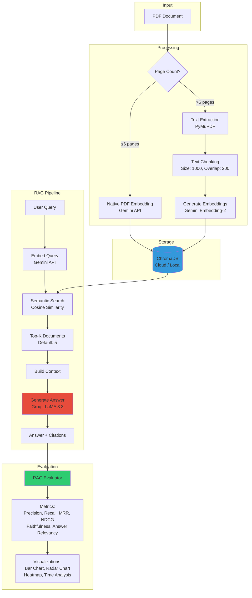
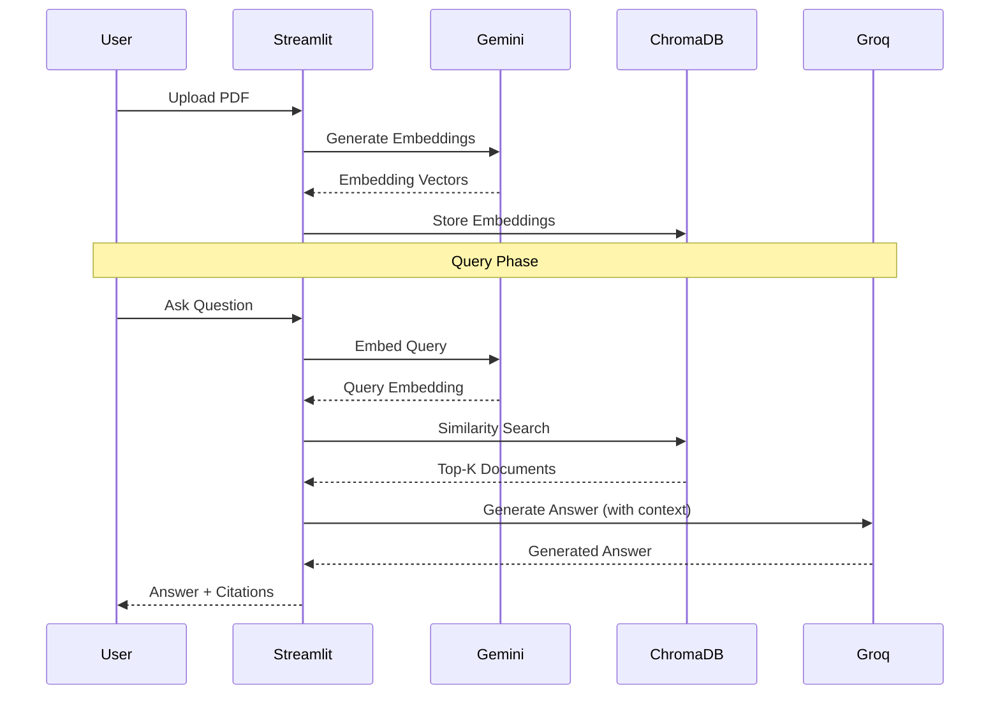

# PDF RAG System with ChromaDB

> Sistem Retrieval-Augmented Generation (RAG) untuk dokumen PDF menggunakan **Google Gemini Embedding**, **ChromaDB**, dan **Groq LLM**. Dilengkapi dengan evaluasi metrik dan visualisasi performa.

## Fitur Utama

- **Smart PDF Processing** - Native embedding untuk PDF pendek (≤6 halaman), text chunking untuk PDF panjang
- **ChromaDB Integration** - Support ChromaDB Cloud dan Local storage
- **RAG Pipeline** - Retrieval dengan semantic search + Generation dengan Groq LLM
- **Interactive Chatbot** - Streamlit UI untuk tanya jawab interaktif
- **RAG Evaluation** - Metrik lengkap (Precision, Recall, MRR, NDCG, Faithfulness, dll)
- **Visualization** - Grafik performa (bar chart, radar chart, heatmap)

## Arsitektur Sistem



## Pipeline Workflow



## Instalasi

### 1. Clone Repository

```bash
cd pdf-embedding-starter
```

### 2. Setup Virtual Environment

```bash
# Create virtual environment
python -m venv venv

# Activate
# Windows:
venv\Scripts\activate
# Mac/Linux:
source venv/bin/activate
```

### 3. Install Dependencies

```bash
pip install -r requirements.txt
```

### 4. Konfigurasi Environment

Copy `.env.example` ke `.env`:

```bash
copy .env.example .env    # Windows
cp .env.example .env      # Mac/Linux
```

Edit `.env` dan isi kredensial:

```env
# Google Gemini API (for embeddings)
GEMINI_API_KEY=your_gemini_api_key

# Groq API (for LLM generation)
GROQ_API_KEY=your_groq_api_key

# ChromaDB Cloud (opsional)
USE_CHROMA_CLOUD=true
CHROMA_CLOUD_API_KEY=your_chromadb_api_key
CHROMA_CLOUD_TENANT=your_tenant_id
CHROMA_CLOUD_DATABASE=your_database_name

# ChromaDB Local (alternatif)
CHROMA_PERSIST_DIR=./chroma_db
CHROMA_COLLECTION_NAME=pdf_embeddings
```

**Dapatkan API Keys:**
- Gemini API: https://aistudio.google.com/app/apikey
- Groq API: https://console.groq.com/keys
- ChromaDB Cloud: https://www.trychroma.com/

## Cara Penggunaan

### Pipeline 1: PDF → Embedding → ChromaDB (Direct)

```bash
# Proses PDF langsung ke ChromaDB (1 langkah)
python pdf_to_chromadb.py "dokumen.pdf" --cloud

# Atau untuk local ChromaDB
python pdf_to_chromadb.py "dokumen.pdf" --local
```

### Pipeline 2: PDF → JSON → ChromaDB (2 langkah)

```bash
# Step 1: Generate embedding dan simpan ke JSON
python chat_terminal.py

# Step 2: Upload JSON ke ChromaDB
python store_to_chromadb.py "dokumen_embedding.json" --cloud
```

### Menjalankan Chatbot

```bash
# Jalankan Streamlit app
streamlit run app.py
```

Aplikasi akan:
- Auto-load data dari ChromaDB saat dibuka
- Menerima pertanyaan dalam bahasa natural
- Mencari dokumen relevan dengan similarity search
- Generate jawaban menggunakan Groq LLM
- Menampilkan jawaban dengan citations

### Evaluasi RAG System

```bash
# Jalankan evaluasi dengan test dataset
python run_evaluation.py test_dataset.json --cloud

# Dengan custom delay (untuk menghindari rate limit)
python run_evaluation.py test_dataset.json --cloud --delay 5

# Output akan tersimpan di folder evaluation_results/
```

**Output Evaluasi:**
- `metrics_bar_chart.png` - Bar chart semua metrik
- `metrics_radar_chart.png` - Radar chart performa
- `time_performance.png` - Analisis waktu eksekusi
- `per_query_heatmap.png` - Heatmap metrik per query
- `evaluation_report.txt` - Report lengkap
- `evaluation_metrics.json` - Metrik dalam format JSON

## Struktur Project

```
pdf-embedding-starter/
├── config.py                  # Konfigurasi environment
├── pdf_processor.py           # PDF extraction & chunking
├── embedding_service.py       # Gemini & Groq API wrapper
├── chromadb_service.py        # ChromaDB operations
├── rag_evaluator.py           # RAG evaluation metrics
│
├── pdf_to_chromadb.py         # Pipeline: PDF → ChromaDB
├── store_to_chromadb.py       # Pipeline: JSON → ChromaDB
├── chat_terminal.py           # Terminal-based chatbot
├── app.py                     # Streamlit web UI
├── run_evaluation.py          # Evaluasi & visualisasi
│
├── test_dataset.json          # Test dataset untuk evaluasi
├── test_chromadb_connection.py # Test koneksi ChromaDB
│
├── requirements.txt           # Python dependencies
├── .env.example              # Template environment variables
├── EVALUATION_GUIDE.md       # Panduan evaluasi
├── README_CHROMADB.md        # Dokumentasi ChromaDB
└── STREAMLIT_DEPLOYMENT.md   # Panduan deployment
```

## Metrik Evaluasi

### Retrieval Metrics
- **Precision** (0-1): Relevansi dokumen yang di-retrieve
- **Recall** (0-1): Coverage dokumen relevan yang ditemukan
- **MRR**: Mean Reciprocal Rank
- **NDCG**: Normalized Discounted Cumulative Gain

### Generation Metrics
- **Semantic Similarity** (0-1): Kesamaan jawaban dengan ground truth
- **Answer Length**: Panjang jawaban dalam kata

### End-to-End Metrics
- **Faithfulness** (0-1): Seberapa jawaban sesuai dengan context
- **Answer Relevancy** (0-1): Seberapa jawaban menjawab pertanyaan

### Performance Metrics
- **Retrieval Time**: Waktu untuk retrieve dokumen
- **Generation Time**: Waktu untuk generate jawaban
- **Total Time**: Total waktu end-to-end

## Interpretasi Score

- **>0.8**: Sangat baik
- **0.6-0.8**: Baik
- **0.4-0.6**: Cukup (perlu improvement)
- **<0.4**: Kurang baik (perlu perbaikan signifikan)

## Use Cases

1. **Document Q&A System** - Chatbot untuk menjawab pertanyaan dari dokumen
2. **CV/Resume Analysis** - Ekstraksi informasi dari CV kandidat
3. **Knowledge Base** - Sistem pencarian dokumen internal perusahaan
4. **Research Assistant** - Analisis paper dan dokumen penelitian
5. **Legal Document Search** - Pencarian dokumen legal dan kontrak

## Technology Stack

- **Embedding Model**: Google Gemini Embedding-2 (768 dimensions)
- **Vector Database**: ChromaDB (Cloud/Local)
- **LLM**: Groq LLaMA 3.3 70B
- **PDF Processing**: PyMuPDF
- **Web Framework**: Streamlit
- **Evaluation**: Custom RAG metrics + Visualization

## Tips & Best Practices

### Untuk Retrieval yang Lebih Baik:
1. Adjust `CHUNK_SIZE` dan `CHUNK_OVERLAP` sesuai domain dokumen
2. Gunakan `top_k` yang optimal (default 5, coba 3-10)
3. Untuk dokumen teknis, gunakan chunk size lebih besar (1500-2000)

### Untuk Generation yang Lebih Baik:
1. Sesuaikan prompt di `embedding_service.py:71-95`
2. Gunakan model LLM yang lebih baik jika perlu
3. Adjust temperature untuk kontrol kreativitas jawaban

### Untuk Evaluasi yang Akurat:
1. Buat test dataset yang representatif
2. Gunakan ground truth yang factual
3. Specify relevant_docs dengan tepat
4. Test dengan berbagai top-k values

## Troubleshooting

**Error: "API Quota Groq habis"**
- Tunggu beberapa menit atau upgrade ke paid tier
- Gunakan `--delay` parameter saat evaluasi

**Error: "ChromaDB http-only client mode"**
- Set `USE_CHROMA_CLOUD=false` untuk gunakan local
- Atau lihat `STREAMLIT_DEPLOYMENT.md` untuk solusi

**Low Evaluation Scores**
- Periksa kualitas test dataset
- Adjust chunking parameters
- Improve prompt LLM

## Deployment

Untuk deployment ke Streamlit Cloud, lihat panduan lengkap di:
- `STREAMLIT_DEPLOYMENT.md`

## Contributing

Contributions welcome! Silakan buat issue atau pull request.

## License

MIT License

## Author

Happy Syahrul Ramadhan
Data Engineering Project

## Acknowledgments

- Google Gemini API untuk embedding
- Groq untuk inference LLM
- ChromaDB untuk vector database
- Streamlit untuk web framework
