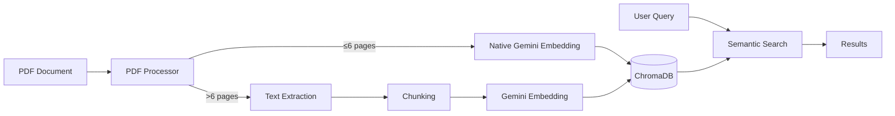

# 📄 PDF Embedding Starter

> Embed PDF documents using **Google Gemini Embedding API** and store results in **ChromaDB** for semantic search & RAG.

## ✨ Features

- 🧠 **Gemini Embedding** — Uses `gemini-embedding-2` (latest multimodal model)
- 📑 **Smart PDF Handling** — Native PDF embedding for short docs (≤6 pages), text extraction + chunking for longer docs
- 🗄️ **ChromaDB Storage** — Persistent vector database for fast semantic search
- 🔍 **Semantic Search** — Query your documents in natural language
- 📦 **Structured Project** — Clean, modular Python code ready to extend

## 🚀 Quick Start

### 1. Setup

```bash
# Clone / enter the project
cd pdf-embedding-starter

# Create virtual environment
python -m venv venv

# Activate it
# Windows:
venv\Scripts\activate
# Mac/Linux:
source venv/bin/activate

# Install dependencies
pip install -r requirements.txt
```

### 2. API Key

Dapatkan Gemini API Key dari [Google AI Studio](https://aistudio.google.com/app/apikey).

> ⚠️ **Important:** Pastikan API key yang kamu gunakan adalah key Google AI (biasanya diawali `AIza...`), **bukan** API key dari layanan lain.

Copy file `.env.example` ke `.env` dan isi API key-mu:

```bash
copy .env.example .env    # Windows
# atau
cp .env.example .env      # Mac/Linux
```

Edit `.env`:
```env
GEMINI_API_KEY=AIza...your-actual-key-here
```

### 3. Usage

**Embed a PDF:**
```bash
python main.py embed path/to/document.pdf
```

**Search your documents:**
```bash
python main.py query "What is this document about?"
python main.py query "Explain the key findings" -k 10
```

**Check database stats:**
```bash
python main.py info
```

**List collections:**
```bash
python main.py list
```

## 🏗️ Project Structure

```
pdf-embedding-starter/
├── main.py                 # CLI entry point
├── config.py               # Configuration (API key, model, etc.)
├── pdf_processor.py        # PDF text extraction & chunking
├── embedding_service.py    # Gemini embedding API wrapper
├── chroma_service.py       # ChromaDB integration
├── requirements.txt        # Dependencies
├── .env.example            # Environment variables template
├── .gitignore
└── README.md
```

## ⚙️ Configuration

All settings in `.env`:

| Variable | Default | Description |
|---|---|---|
| `GEMINI_API_KEY` | — | **Required.** Your Google AI API key |
| `EMBEDDING_MODEL` | `gemini-embedding-2` | Gemini embedding model |
| `EMBEDDING_DIMENSIONALITY` | `768` | Output dimensions (768, 1536, or 3072) |
| `CHROMA_COLLECTION_NAME` | `pdf_embeddings` | ChromaDB collection name |
| `CHROMA_PERSIST_DIR` | `./chroma_db` | ChromaDB storage directory |
| `CHUNK_SIZE` | `1000` | Characters per chunk (long PDFs) |
| `CHUNK_OVERLAP` | `200` | Overlap between chunks |

## 🧠 How It Works



## 📦 Dependencies

- `google-genai` — Google Gemini API Python SDK
- `chromadb` — Vector database
- `PyMuPDF` — PDF text extraction
- `python-dotenv` — Environment variable management
- `tqdm` — Progress bars

## 🔮 Next Steps / Ideas

- Integrate with **LangChain** for full RAG pipeline
- Add a **Streamlit UI** for interactive document Q&A
- Support **batch processing** multiple PDFs
- Add **document summaries** using Gemini generation
- Export embeddings to **JSON/parquet** for sharing

## 📝 License

MIT
